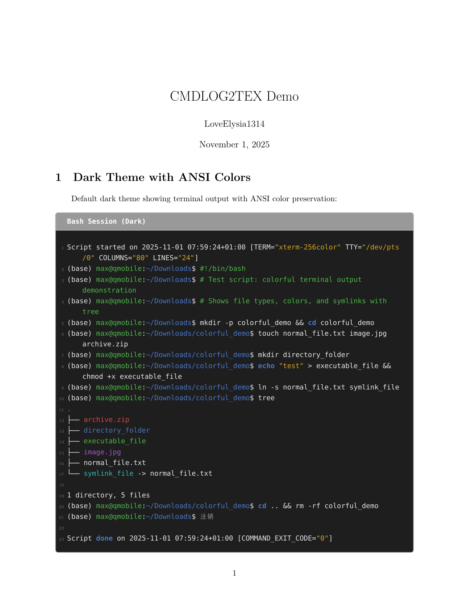

# cmdlog2tex

[](LICENSE)
[](https://www.python.org/downloads/)
[](https://github.com/LoveElysia1314/cmdlog2tex)

**Languages:** English | [简体中文](README_CN.md)

---

Convert terminal commands/logs (ANSI colors supported) into beautiful LaTeX documents. Three CLI tools are included:

- cmd2log — execute a command list and capture logs
- log2tex — convert a log into LaTeX
- cmd2tex — full pipeline (recommended)

Suitable for experiment reports, technical docs, and training materials.

---

## Demo

You can view a sample output PDF here: [example/demo.pdf](example/demo.pdf)

Below is a preview of the first page of the sample PDF:



---

## Install

```bash
pip install cmdlog2tex
```

---

## Quick start

Recommended: full pipeline

```bash
# Execute command list and produce a LaTeX document
cmd2tex --input commands.txt --output output.tex
```

Pick a shell explicitly if needed:

```bash
# Windows (cmd)
cmd2tex --input commands.txt --output output.tex --shell cmd

# Windows (PowerShell)
cmd2tex --input commands.txt --output output.tex --shell powershell

# Linux / macOS (bash)
cmd2tex --input commands.sh --output output.tex --shell bash
```

---

## CLI overview

### cmd2tex — full pipeline

```text
cmd2tex -i FILE -o FILE [options]

Required:
  -i, --input FILE          Command list file
  -o, --output FILE         Output LaTeX file (default: <input>.tex)

Optional:
  -s, --shell SHELL         powershell | cmd | bash
  -p, --plain               Use plain text (default)
  -c, --colored             Use colored text (ANSI logs only)
  -d, --dark                Dark theme (default)
  -l, --light               Light theme
  --language LANG           LaTeX language tag (default: text)
```

### cmd2log — capture only

```text
cmd2log -i FILE [-o FILE] [--shell SHELL]
```

- Windows: generates <base>.txt
- Linux/macOS: generates <base>.ansilog

### log2tex — convert only

```text
log2tex -i FILE [-o FILE] [-p | -c] [-d | -l] [--language LANG]
```

- Output .tex goes next to the input by default.
- Colored mode is effective only for ANSI logs (e.g., .ansilog).

### Tip: short-option concatenation

The CLI accepts concatenated short options for fast typing:

- `-cd`  → `-c -d`
- `-pl`  → `-p -l`
- `-cpython` → `-c --language python`
- `-pbash`   → `-p --language bash`

---

## Outputs and platform behavior

The tool writes different files depending on platform and whether ANSI colors are present.

Windows (cmd / PowerShell):

```
commands.txt
  ↓ cmd2tex
  ├─ commands.txt           (log, plain text)
  └─ output.tex             (final LaTeX)
```

- No intermediate `.plain.txt` / `.color.txt` are created for plain logs.

Linux / macOS (bash, ANSI colors expected):

```
commands.sh
  ↓ cmd2tex
  ├─ commands.ansilog       (raw ANSI session)
  ├─ commands.plain.txt     (ANSI-stripped plain text)
  ├─ commands.color.txt     (ANSI → LaTeX color sequences)
  └─ output.tex             (final LaTeX)
```

`output.tex` includes one of the sidecar files via `\\terminput`.

---

## LaTeX usage

Minimal example (XeLaTeX recommended):

```latex
\documentclass{article}
\usepackage{ctex} % optional, for CJK
\usepackage{terminalcode}

\begin{document}

\terminput[text]{Terminal}{commands.plain.txt}

\end{document}
```

- If LaTeX reports `Undefined control sequence \terminput`, copy `terminalcode.sty` to your LaTeX working directory (the tool also copies it next to `output.tex`).
- Theme switching: `\terminalcodetheme{dark}` (default) or `\terminalcodetheme{light}`.

---

## Troubleshooting

- LaTeX macro missing: copy `terminalcode.sty` next to your .tex and compile with XeLaTeX.
- Garbled CJK characters: ensure UTF-8 files and use XeLaTeX.
- Windows script execution denied (PowerShell): set execution policy for current user.

---

## Known limitations

- Some complex ANSI sequences may not map perfectly; 256/true-color are partially supported.
- Long unbroken lines may overflow in LaTeX; consider manual wrapping.
- Bold/italic styling inside `\verb` is inherently limited in LaTeX (worked around via escape markers).
- Session metadata filtering (PowerShell/Cmd) is not applied by default in the current release.

---

## License & Contributing

MIT License. PRs and issues are welcome: https://github.com/LoveElysia1314/cmdlog2tex

---

Version: 0.9.0  
Updated: 2025-11-01
